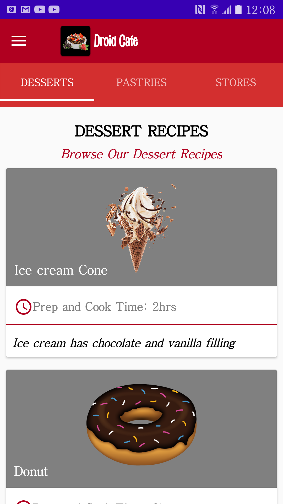

Material_Droid_Cafe
Material Droid Cafe is an android application for a cafe. 
It consists of tabs with different categories of food. 
In each tab there is a recyclerview that consitutes of card views with different type of food. 
Once the card of a specific food is clicked then a new activity displays the recipe of that food. 
The application also has a navigaton drawer. When the menu items are clicked then a new fragment is displayed.

